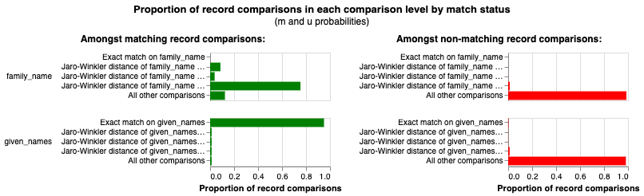

# Entity resolution: from 17,722 person mentions to 8,947 people

The parser returns every person as they appear in the entry:
"ADORNO, Theodor W.", "ADORNO, Th. W." and "Adorno, Theodor W." are three
mentions of one person. Author search only works if the database knows
that. This page is what it took.

Two constraints shaped everything:

- **The link from each mention to its book must survive.** A mention
  carries the `composite_id` of its book. Any grouping that loses that
  link is useless.
- **The original spelling must survive too.** `display_name` keeps what my
  grandfather wrote; `unified_id` is the normalised key that groups
  spellings. Both are stored on every `books2people` row.

## Iteration 1: two API passes

Code: [`pipeline/iteration-1/05_people/`](../pipeline/iteration-1/05_people/).

**Pass 1, split.** 64 rows had no `family_name` and an " und " or " u. "
in the name: "Otto Abel u. Wilhelm Wattenbach" is two people. Sent in
3 batches, returned as separate people with a `sort_order`.

**Pass 2, group.** 17,702 rows, batched **by normalised surname** so that
every spelling of one name lands in the same request: 7,076 surname
groups, 252 batches of about 70 rows. The model returns a `unified_id`
per row and a `variants` list. Anything it was unsure about got
`unified_id: "oops"` for manual review, under 1%.

Batching by surname is the decision that made this work. A random batch
of 70 rows contains no duplicates to find; a surname batch contains all
of them.

Before the API passes there was a non-API attempt, `normalise_people.py`,
that grouped by normalised string with RapidFuzz. It found the easy cases
and stalled on abbreviations ("A. Schmidt" against "Anna Schmidt" against
"Schmidt, A.") and on transliterated Slavic names, where the same person
appears as Dostojewski, Dostojewskij and Dostoevsky. The notebooks under
`scripts/notebooks/` are that work.

Cost: about 6 €, 3h45.

## Iteration 2: match onto what exists

Code: [`pipeline/iteration-2/04_people/`](../pipeline/iteration-2/04_people/).

The reload produced 9,060 unique name spellings (15,892 mentions). The
database already held 7,817 people with their variants from iteration 1.
Deduplicating from scratch would have thrown that away, so:

| Step | What | Result |
|---|---|---|
| exact match | each new spelling against the existing variants | 5,595 of 9,060 matched (62%) |
| clean (operation A) | every existing person through the model once, to redistribute prefixes, particles and suffixes into the new columns | 7,817 people, 16 batches of 500 |
| nopes (operation B) | the 1,223 still-unmatched names, batched by surname, with the matching existing people sent as context; the model points at an existing person or creates a new one | 41 batches |
| reattach | put the book links back onto the resolved people | `people_nopes_reattach.py` |

62% was the disappointing number. The other 38% were mostly spelling
variants the exact match could not see, which is what the nopes pass with
context was for. A temporary `people_variants` table held the known
spellings during this step and was dropped afterwards.

After the load, `books2people` was found incomplete; 1,441 and then 734
rows were added in June 2026 (`fix_missing/`). A few hundred books still
have no people rows.

## Splink: an unfinished experiment

Notebooks: `scripts/notebooks/16_0_lets_splink_existing people.ipynb`,
`16_1_lets_splink_this.ipynb`. Model: `splink_model.json`.

For the 1,008 re-parsed books and the remaining unmatched names I tried
[Splink](https://moj-analytical-services.github.io/splink/), a
probabilistic record-linkage library, with DuckDB as the backend,
comparing `family_name` and `given_names` with Jaro-Winkler levels and
blocking on each in turn for the EM training.

The first trained model was wrong, and the chart shows where:



The left panel is the m probability: among record pairs that *are* the
same person, how often does each comparison level fire. For
`family_name`, "exact match" is near zero and "Jaro-Winkler ≥ 0.7" is
near 0.8. Read literally, that says two mentions of the same person
almost never share an exact surname, which is false for this data. The
consequence is in the match weights: an exact surname match carried a
large **negative** weight, so the model penalised the strongest evidence
it had.

The cause is in Splink's own training output: "parameter estimates cannot
be made for comparisons used in the blocking rules". Expectation
maximisation runs once per blocking rule and can only estimate the
comparisons that rule does not block on. So `family_name` was only ever
estimated in the pass blocked on the first letter of `given_names`. Within
a block of people who share a first initial, pairs that are the same
person and also share an exact surname are a small minority of all pairs,
and EM learned that minority as the m probability. That is a property of
the block, not of the data.

The fix (commit `36c7f02`, 2026-09-01) takes that level out of EM's
hands. The exact-match level on `family_name` is built with
`comparison_level_library` and its m probability is set to 0.9 and
locked:

```python
cll.ExactMatchLevel("family_name").configure(
    tf_adjustment_column="family_name",
    m_probability=0.9,
    fix_m_probability=True,
),
```

0.9 is a judgement, not an estimate: if two mentions are the same person,
the surname is written identically about nine times in ten in this data.
The term-frequency adjustment keeps a match on "Müller" worth less than a
match on "Dostojewski". The saved `splink_model.json` is the model after
this change. The prediction step on the unmatched names has not been run
with it yet.

## Open

- Run the fixed Splink model on the remaining unmatched names and the
  people of the 1,008 re-parsed books.
- A few hundred books with no people rows.
- 20 books where `books2people` holds the same person twice (editor and
  translator as two rows instead of one row with both flags); merge, then
  add `UNIQUE (book_id, person_id)`.
- An idea not started: link `people` to the Deutsche Nationalbibliothek's
  Gemeinsame Normdatei (GND) to get authority records for the people who
  have them.
