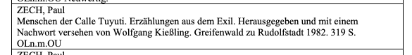
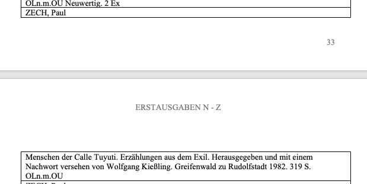
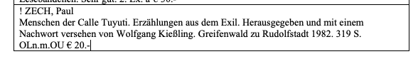
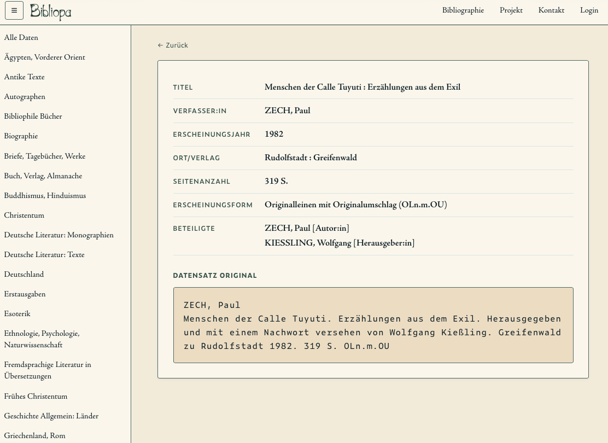
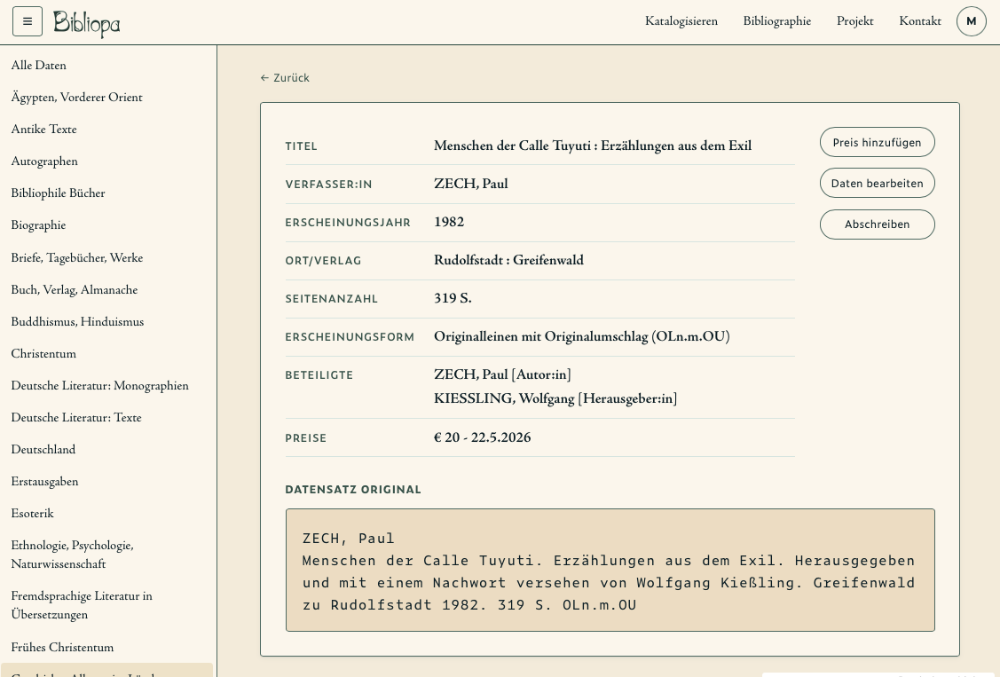

# One book, traced end to end

One real entry, followed from the Word table through both migration runs
into the database and the live app.

**The book:** Paul Zech, *Menschen der Calle Tuyuti. Erzählungen aus dem
Exil.* Topic `erstausgaben`, `book_id` 1171.

It is here because its `composite_id` is different in the two iterations.
That is not a special case — 9,181 of roughly 10,900 books changed id
between the runs. It is the reason the second iteration could not simply
join on the id.

---

## 1. The Word row

### Iteration 1 (2025-09)

The first run had two non-identical versions of the catalogue to work
from: `kp`, authoritative for the text, and `p`, which carried the prices.
Neither was complete on its own, so the first stage of iteration 1 was
collating them.

The entry in `kp` — one cell in a table, author line then body, no price:



The same entry in `p`:



The cell happens to fall across a page break, which is why `ZECH, Paul`
appears at the foot of one page and the body at the top of the next. That
is Word rendering one cell, not two cells — the entry is intact.

This book has no price in `p` either. It had none in either old version.

### Iteration 2 (2026-05)



The corrected document, `ERSTAUSGABEN N - Z.docx`. Two things changed:
the row is marked `! ` (edited since the last run), and it now carries a
price, `€ 20.-`. Neither of the older versions had a price for this book.

What `python-docx` reads out of that cell:

```python
'! ZECH, Paul \nMenschen der Calle Tuyuti. Erzählungen aus dem Exil. Herausgegeben und mit einem Nachwort versehen von Wolfgang Kießling. Greifenwald zu Rudolfstadt 1982. 319 S. OLn.m.OU € 20.-'
```

---

## 2. Extracted, with the price taken out

`pipeline/iteration-2/01_extract/transform_docx.py` turns that cell into:

```json
{
  "text": "ZECH, Paul || Menschen der Calle Tuyuti. Erzählungen aus dem Exil. Herausgegeben und mit einem Nachwort versehen von Wolfgang Kießling. Greifenwald zu Rudolfstadt 1982. 319 S. OLn.m.OU",
  "source": "ERSTAUSGABEN N - Z.docx",
  "price": 20,
  "topic": "erstausgaben",
  "topic_normalised": "erstausgaben3"
}
```

Four things happened in that step:

- Rows beginning `AUS! ` are skipped entirely — the book is gone from the
  collection. This one is not such a row.
- The price is matched, converted to an integer, and **removed from the
  text**. A price never stays in `original_entry`; it belongs in its own
  field, because there can be several prices per book over time.
- The leading `! ` is stripped once the row has been recognised as edited.
- The line break inside the cell becomes ` || `, so the entry survives as
  a single string and the break can be restored later.

---

## 3. The `composite_id`, and why it moved

Both runs build the id with the same formula:

```python
record["composite_id"] = f"{topic_normalised}_{index}_{batch_id}_{total_batches}"
```

| | iteration 1 | iteration 2 |
|---|---|---|
| `composite_id` | `erstausgaben3_1918_77_79` | `erstausgaben_1461_59_78` |
| slug | `erstausgaben3` | `erstausgaben` |
| index | 1918 | 1461 |
| batch | 77 of 79 | 59 of 78 |

Every component is different, for two separate reasons.

**The slug.** Both runs concatenate `erstausgaben1`, `erstausgaben2` and
`erstausgaben3` into one topic. Iteration 1 rewrote
`record["topic_normalised"]` to `"erstausgaben"` inside the loop, but built
the id from the loop's own `topic_normalised` variable, which was still
`"erstausgaben3"`. Iteration 2 reassigns the variable before batching, so
the id matches the topic. The ids differ because of a fix, not because the
data moved.

**The index.** The index is the entry's position in the combined list.
Removing the `AUS! ` rows above it shifts everything below, and the files
are read with `Path.iterdir()`, whose order is not guaranteed. A shift of
457 positions cannot be attributed to either cause alone.

Either way the id is positional, so it cannot identify the same book
across two runs. Iteration 2 matched on the normalised `original_entry`
text instead.

---

## 4. Parsed

The entry goes to the Claude API in a batch of 25. What came back:

**Iteration 1** — `data/backup/really_old/backup_parsed/batch_erstausgaben3_77-79.json`

```json
{
  "custom_id": "erstausgaben3_1918_77_79",
  "parsed_entry": {
    "title": "Menschen der Calle Tuyuti",
    "subtitle": "Erzählungen aus dem Exil",
    "authors": [{"display_name": "ZECH, Paul", "family_name": "Zech", "given_names": "Paul"}],
    "editors": [{"display_name": "Kießling, Wolfgang", "family_name": "Kießling", "given_names": "Wolfgang"}],
    "publisher": null,
    "place_of_publication": "Greifenwald zu Rudolfstadt",
    "publication_year": 1982,
    "pages": 319,
    "format_original": "OLn.m.OU",
    "format_expanded": "Originalleinen mit Originalumschlag",
    "price": null,
    "administrative": {
      "original_entry": "ZECH, Paul . Menschen der Calle Tuyuti. …",
      "parsing_confidence": "high",
      "needs_review": false,
      "verification_notes": null
    }
  }
}
```

**Iteration 2** — `data/parsed/batch_erstausgaben_59-78.json`

```json
{
  "custom_id": "erstausgaben_1461_59_78",
  "price": 20,
  "parsed_entry": {
    "title": "Menschen der Calle Tuyuti",
    "subtitle": "Erzählungen aus dem Exil",
    "authors": [{"display_name": "ZECH, Paul"}],
    "editors": [{"display_name": "Kießling, Wolfgang"}],
    "publisher": "Greifenwald",
    "place_of_publication": "Rudolfstadt",
    "publication_year": 1982,
    "pages": 319,
    "administrative": {
      "original_entry": "ZECH, Paul || Menschen der Calle Tuyuti. …",
      "corrected_by_api": false,
      "missing_person": false,
      "multiple_editions": false,
      "api_concerned": true,
      "problematic_multi_volume": false,
      "verification_notes": "The publisher is listed as 'Greifenwald zu Rudolfstadt', which is an unusual formulation. The known publisher for this work is 'Greifenverlag zu Rudolfstadt' (Greifenverlag). 'Greifenwald' may be a typo for 'Greifenverlag'; flagged for human verification rather than auto-corrected."
    }
  }
}
```

The second run split `Greifenwald zu Rudolfstadt` into publisher and
place, and raised `api_concerned` with a note: the catalogue says
*Greifenwald*, the publisher is *Greifenverlag*. The instruction was to
flag rather than silently correct, so the typo is preserved and marked.
The flag prompt is the visible difference between the two parsing runs.

---

## 5. Prepared for loading

`pipeline/iteration-2/05_prepare/prep_parsed.py` splits the record into
the shapes the tables expect, restores the line break, and derives
`is_active` from the flags:

```json
{
  "books_data": {
    "composite_id": "erstausgaben_1461_59_78",
    "is_active": 0,
    "title": "Menschen der Calle Tuyuti",
    "subtitle": "Erzählungen aus dem Exil",
    "publisher": "Greifenwald",
    "place_of_publication": "Rudolfstadt",
    "publication_year": 1982,
    "pages": 319,
    "topic_id": 27
  },
  "admin_data": {
    "composite_id": "erstausgaben_1461_59_78",
    "original_entry": "ZECH, Paul\nMenschen der Calle Tuyuti. Erzählungen aus dem Exil. …",
    "api_concerned": true,
    "verification_notes": "The publisher is listed as 'Greifenwald zu Rudolfstadt' …"
  },
  "price_data": {
    "amount": 20,
    "imported_price": true
  },
  "volumes_data": {"volumes": []}
}
```

` || ` has become `\n` again. `is_active` is 0 because `api_concerned` is
true, which would keep the entry out of the public list until it had been
looked at — see section 6 for why the live row is 2. `imported_price` is
true: the 20 came from the document, not from someone typing it into the
app.

---

## 6. In the database

`book_id` 1171.

**`books`**

```json
{"book_id": 1171, "composite_id": "erstausgaben_1461_59_78", "is_active": 2,
 "is_removed": false, "title": "Menschen der Calle Tuyuti",
 "subtitle": "Erzählungen aus dem Exil", "publisher": "Greifenwald",
 "place_of_publication": "Rudolfstadt", "publication_year": 1982, "pages": 319,
 "format_original": "OLn.m.OU", "format_expanded": "Originalleinen mit Originalumschlag",
 "topic_id": 27, "created_at": "2026-05-22 10:36:31", "updated_at": "2026-07-28 12:42:37"}
```

**`book_admin`** keeps the entry exactly as the document had it, price
removed:

```json
{"book_id": 1171, "original_entry": "ZECH, Paul\nMenschen der Calle Tuyuti. Erzählungen aus dem Exil. Herausgegeben und mit einem Nachwort versehen von Wolfgang Kießling. Greifenwald zu Rudolfstadt 1982. 319 S. OLn.m.OU",
 "api_concerned": true, "verification_notes": "The publisher is listed as 'Greifenwald zu Rudolfstadt' …"}
```

`is_active` is 2 here, not the 0 that came out of the preparation step,
and `updated_at` is two months after the load. That is a manual change I
made. Holding flagged entries back for review was my decision; my
grandfather's priority was that every entry show up as it was, with review
happening later or not at all. So the flagged entries were set to 2 and
made visible, and `api_concerned` stays true on the row. I keep a separate
list of every entry I changed this way, so the review is still possible.

**`prices`** — `amount` 20, `imported_price` true.

**`books2people`** — two rows, each pointing at a person who already
existed after deduplication, with the role from the entry:

```json
[
 {"b2p_id": 116, "book_id": 1171, "person_id": 2107, "unified_id": "zech_paul",
  "display_name": "ZECH, Paul", "is_author": true, "sort_order": 1},
 {"b2p_id": 118, "book_id": 1171, "person_id": 1127, "unified_id": "kiessling_wolfgang",
  "display_name": "Kießling, Wolfgang", "is_editor": true, "sort_order": 1}
]
```

The people themselves are single rows in `people`, reached by
`unified_id`:

```json
{"person_id": 2107, "unified_id": "zech_paul", "family_name": "Zech", "given_names": "Paul"}
{"person_id": 1127, "unified_id": "kiessling_wolfgang", "family_name": "Kießling", "given_names": "Wolfgang"}
```

How those two rows came to be single rows — the two matching passes, the
surname blocking, the cases that needed a human — is `docs/entity-resolution.md`.

---

## 7. In the app

https://bibliopa.vercel.app/books/erstausgaben/1171

As a guest:



Signed in, with the price and the editing actions:



**Datensatz original.** The block at the bottom shows the Word entry as it
stood, unchanged. It is there because my grandfather asked for it: he
wanted the record to look like it did "on his stick" — his catalogue lived
across several USB sticks, and he was not always certain which version he
had last edited. Keeping the original text visible next to the parsed
fields is what made the database trustworthy to him. It is also what makes
this trace possible at all: `book_admin.original_entry` is the only thing
that survives both runs unchanged, and it is what iteration 2 matched on.
